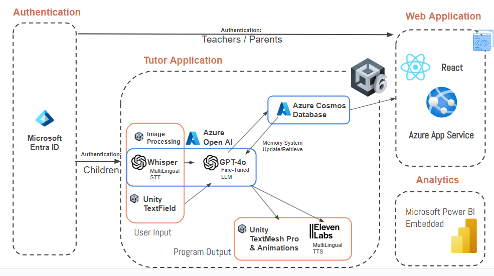

# Ai-TA

**Empowering rural educators with AI-driven tools.**

---

## What does it do?

**Ai-TA is a two-part system built for rural classrooms:**

- A **desktop teaching assistant** powered by AI that interacts directly with students — offering real-time help, adaptive guidance, and multilingual support through a friendly on-screen character.
- A connected **teacher dashboard** that collects and displays live insights, including each student’s engagement, learning progress, and areas of struggle. This allows educators to quickly identify who needs help and tailor their lessons accordingly.

Together, these tools give teachers a way to support large, diverse classrooms

---

## Architecture

Ai-TA is composed of three integrated layers:

1. **Unity Frontend**  
   Built in Unity (Editor version `6000.0.25f1`), the frontend powers a friendly and customizable AI character that interacts with students and teachers in real-time, providing visual, auditory, and text-based support.

2. **Embedded Python Backend**  
   A lightweight Python environment is embedded inside the Unity project (`Ai-Tutor/Assets/StreamingAssets/python-3.11.3-embed-amd64`) to support model inference, real-time processing, and integration with services like GPT-4o and Whisper.

3. **Cloud Services**  
   Powered by Azure, the backend includes:
   - GPT-4o for tutoring responses  
   - Whisper for speech recognition  
   - ElevenLabs for text-to-speech  
   - COSMOS DB for scalable storage  
   - Entra ID for secure user authentication  
   - Azure Content Safety for responsible AI usage

---

## Features

-  **Real-Time Tutoring** — Ai adapts to student behavior using screen and optional camera input  
-  **Dashboards** — Teachers and parents gain visibility into student progress  
-  **Multilingual Support** — Designed to work across languages and regions  
---

## Installation

### Requirements

- Unity Editor version `6000.0.25f1`  
- Windows OS (for embedded Python compatibility)  
- Azure service credentials (GPT-4o, Whisper, etc.)

### Setup Instructions

#### Open in Unity
1. Launch **Unity Hub**
2. Click **“Add”** and select the `Ai-Tutor` folder
3. Open the project using version **6000.0.25f1**

#### Configure APIs
4. Add your **Azure API keys** to the appropriate Unity config or environment files

#### Run the Project
5. Hit the **Play** button in Unity to start testing the application

>  No manual installation is needed for the embedded Python environment — it runs seamlessly with the Unity build.

---

## Credits

- **Character & Image Assets**:  
  With permission from [LorisYounger/VPet](https://github.com/LorisYounger/VPet)

> Special thanks to UMass Amherst faculty and the Microsoft Imagine Cup team.

---
